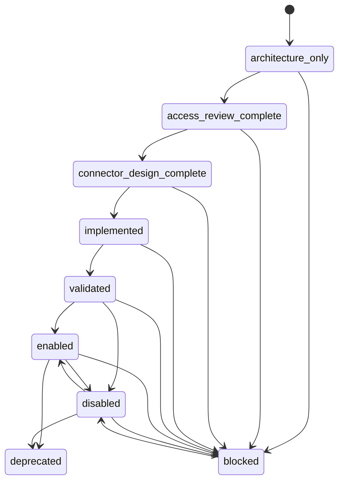

# Connector Platform — LOT 0

## Finalité

`automation.connector_platform` fournit les contrats génériques et indépendants des futurs connecteurs. Le package ne connaît aucun connecteur existant, ne répond à aucune question métier et ne contient aucun transport réseau, endpoint, secret, cache de données ou planificateur actif.

## Architecture

Les 25 modules séparent les responsabilités : contrat et modèles, cycle d'état, erreurs et validation, capacités et métadonnées, santé, limitation/reprise/backoff, sécurité, provenance/licence/citation/document, versionnement/déduplication/empreinte, cache descriptif, ordonnanceur désactivé, statistiques/métriques et registre.

Un état `enabled` existe dans le modèle commun mais le contrat LOT 0 refuse explicitement de créer un connecteur actif.

## Sécurité

La politique par défaut impose simultanément `NETWORK_DISABLED_BY_DEFAULT`, lecture seule, absence de POST et DELETE, absence d'authentification et de secrets, refus des endpoints privés et des redirections externes. Toute tentative d'affaiblissement du modèle lève une erreur.

Les capacités sont déclaratives. Dans ce lot, `AUTHENTICATION`, `SYNC` et `DOWNLOAD` sont refusées par le contrat. L'ordonnanceur est un modèle inactif et ne déclenche aucune tâche.

## Documents, licences et citations

Les niveaux documentaires sont `METADATA_ONLY`, `EXCERPTS`, `FULLTEXT_ALLOWED` et `FORBIDDEN`. Le validateur empêche une politique de dépasser la licence. Les licences inconnues et spécifiques à un document restent limitées aux métadonnées et exigent une revue. CC BY-ND n'autorise jamais le texte intégral.

Une citation conserve URL HTTPS, titre, auteur éventuel, date, version, autorité, licence et confiance. La provenance conserve l'identifiant de source, l'URL canonique, l'horodatage éventuel et l'empreinte.

## Exploitation descriptive

Le journal distingue consultation, erreur, refus, validation, synchronisation et cache, sans exécuter ces opérations. Les statistiques prévoient nombre de documents, consultations, durée moyenne, dernière synchronisation et dernière validation. Les métriques sont typées par nom, valeur et unité.

Le cache est interdit par défaut. Le rate limit, les reprises et le backoff sont des politiques pures sans attente ni appel externe. Le registre est en mémoire, refuse les doublons et n'importe aucun registre existant.

## Confidentialité et limites

Les tests utilisent seulement des identifiants et URLs `.invalid` synthétiques. Aucun document, PDF, contenu officiel, donnée locale, endpoint opérationnel ou clé n'est inclus. L'intégration d'un connecteur existant ou futur est hors périmètre.
